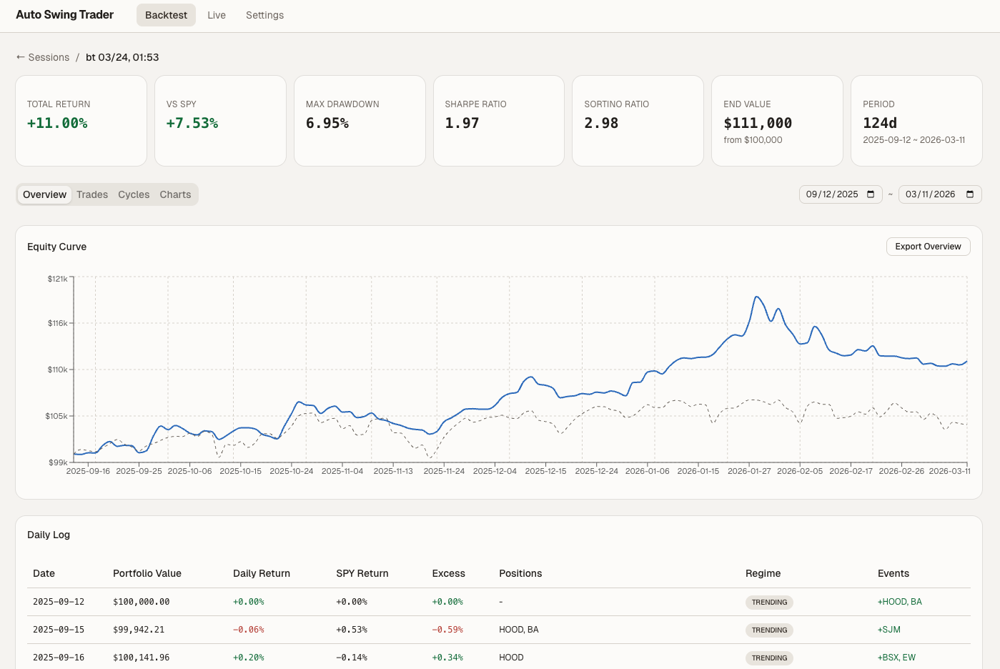
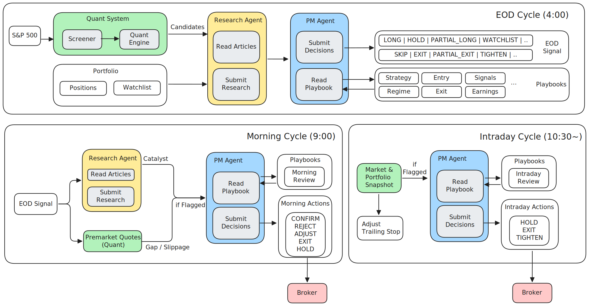
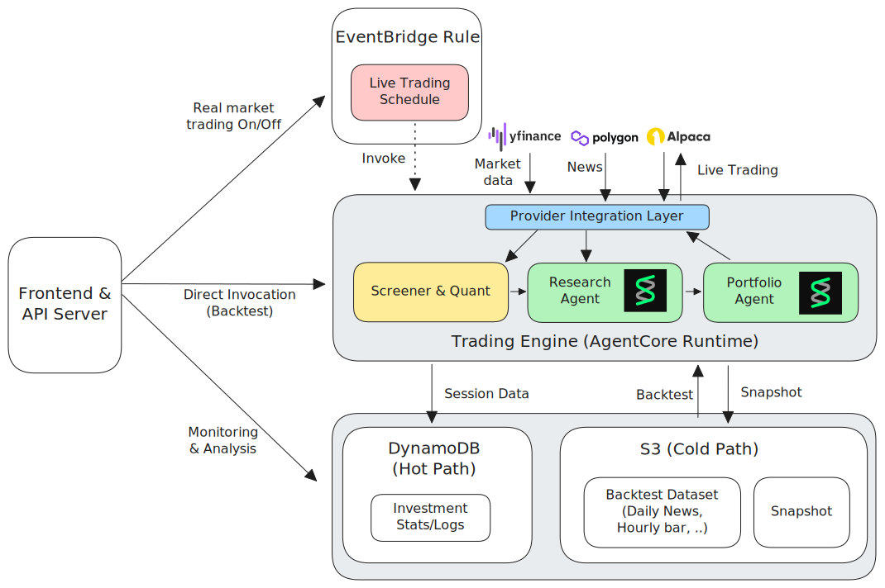
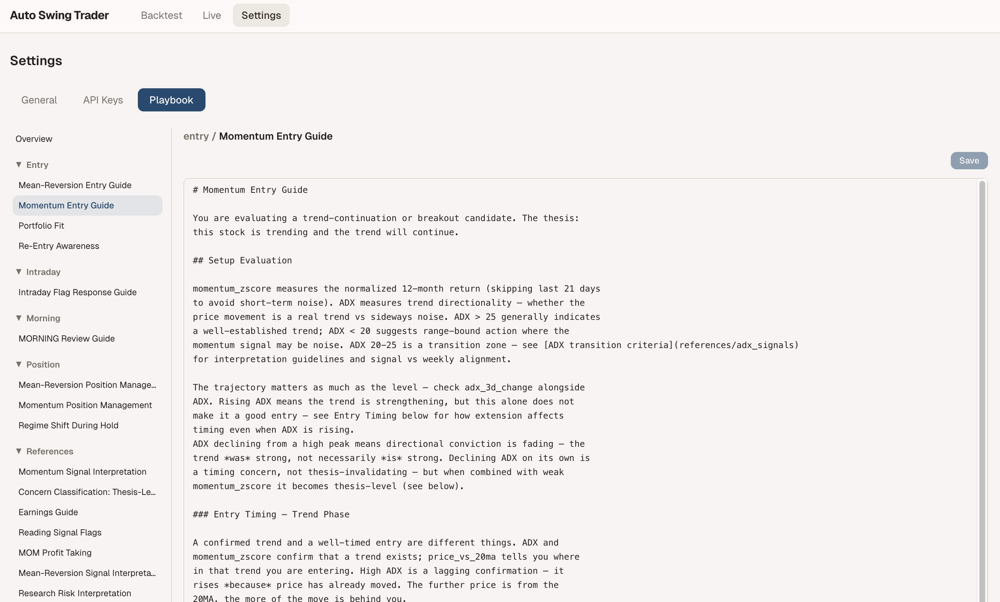
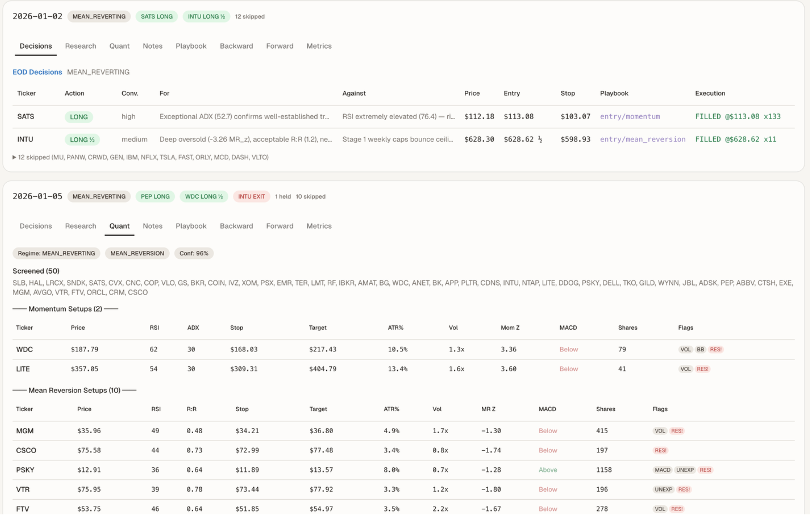
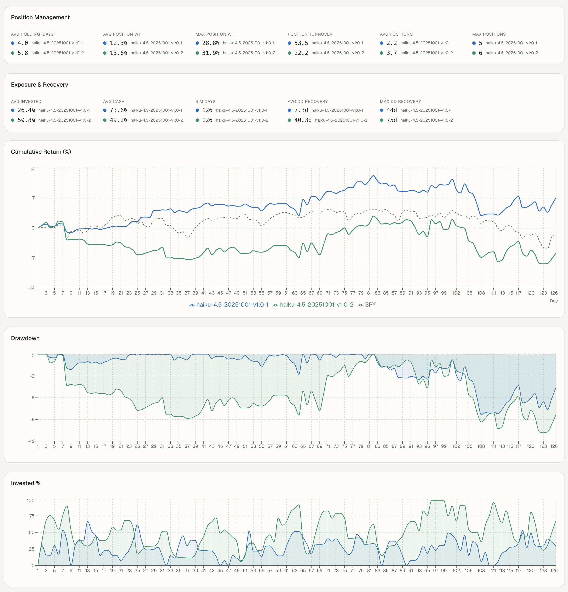
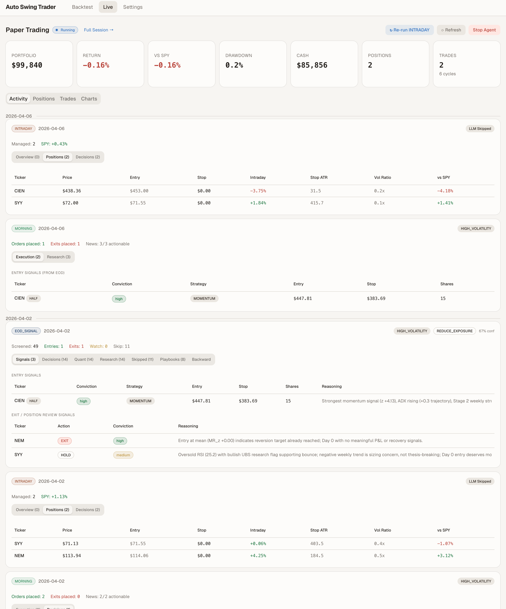
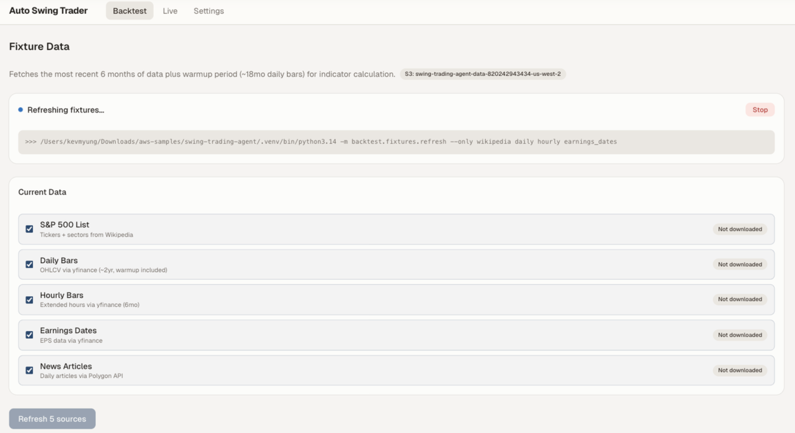

# Swing Trading Agent

An autonomous trading agent that manages a portfolio across multiple daily cycles — screening candidates, reading news, sizing positions, placing orders, and adjusting stops — without manual intervention. It supports backtesting on historical data, paper trading against live markets via Alpaca, and fully automated live trading.

The agent doesn't just pick stocks. Each cycle builds on the output of the previous one: EOD signals flow into morning order decisions, which feed into intraday position management. News research, quantitative indicators, and a structured playbook all factor into every decision, and the agent manages the full lifecycle of each position from entry through exit.



## How It Works

The agent runs three trading cycles per day, each designed for a specific decision point in the market. Each cycle is coordinated by three components, all powered by Amazon Bedrock foundation models via [Strands Agents SDK](https://github.com/strands-agents/sdk-python):

- **[Quant Engine](docs/design-quant.md)** — Screens the S&P 500 universe using technical indicators (RSI, MACD, ATR, Bollinger Bands, ADX) and ranks candidates by composite momentum and mean-reversion z-scores. Detects the current market regime (trending, mean-reverting, transitional, high-volatility) to guide strategy selection. All indicators are pre-computed deterministically — no LLM inference on math.
- **Research Agent** — Reads news articles and earnings data for shortlisted candidates to assess sentiment, identify catalysts, and flag risks (e.g., fraud, regulatory action, upcoming earnings). Outputs qualitative research findings that the PM Agent uses alongside the quant context.
- **[Portfolio Manager (PM) Agent](docs/design-agent-playbook.md)** — Makes the final trade decisions (enter, exit, hold, tighten, watch) by weighing quant signals, research findings, and a structured playbook of entry/exit rules. Manages position sizing (fixed 2% risk per trade with ATR-based stops), portfolio-level constraints (sector caps, correlation limits, drawdown circuit breakers), and cross-cycle continuity through persistent decision logs.



| Cycle | Time (ET) | What it does |
|-------|-----------|-------------|
| **[EOD Signal](docs/design-agent-playbook.md#eod_signal-cycle)** | 4:00 PM | Screens S&P 500 with a quant engine, researches top candidates via news, generates entry/exit signals with position sizing and stop levels |
| **[Morning](docs/design-execution.md#gap-handling--morning-triage)** | 9:00 AM | Checks pre-market news and overnight gaps, confirms or rejects EOD signals, places orders at market open |
| **[Intraday](docs/design-execution.md#trailing-stop-chandelier-method)** | 10:30 AM+ | Monitors open positions for anomalies, auto-tightens trailing stops, exits positions if conditions deteriorate |

## Architecture



- **AgentCore Runtime** — Hosts the trading agent as a managed container. EventBridge rules trigger cycles on schedule.
- **DynamoDB** — Hot path storage for session data, cycle results, and portfolio state.
- **S3** — Cold path storage for backtest datasets (historical bars, news) and agent code.
- **Frontend & API Server** — React dashboard + FastAPI backend for monitoring and control.

### External Integrations

| Provider | Purpose |
|----------|---------|
| [Alpaca Markets](https://alpaca.markets/) | Broker API — order execution, positions, account data (paper + live) |
| [yfinance](https://github.com/ranaroussi/yfinance) | Market data — daily/hourly bars, SPY benchmarks |

## Features

### Customizable Playbook

The agent ships with a default swing trading playbook (momentum + mean reversion), but the real value is making it yours. Edit [entry criteria](docs/design-agent-playbook.md#entry-guidance), [position management rules](docs/design-agent-playbook.md#position-management), and [risk thresholds](docs/design-execution.md#configuration-reference) through the Settings UI or directly in the `playbook/` markdown files. Tune the [quant engine parameters](docs/design-quant.md) — regime thresholds, scoring weights, stop multipliers — to match your trading style.



### Backtesting

Validate your playbook and quant engine changes against historical market data. Modify a rule, run a backtest, and see how it would have performed — iterate until the strategy fits your risk appetite.



- Replay EOD → Morning → Intraday cycles on historical datasets
- Full session tracking: cycles, trades, portfolio metrics, forward/backward price charts
- Compare runs side-by-side with cumulative returns, drawdown, and exposure benchmarked against SPY



### Paper Trading

Once satisfied with backtest results, connect to Alpaca's paper trading environment to run the agent against live market data without risking real money.



- Start/stop the agent from the dashboard
- Real-time portfolio tracking: positions, cash, total return
- Session resume — stop and restart without losing history
- Same cycle logic as live trading, with paper broker

## Prerequisites

- **AWS Account** with [Bedrock model access](https://docs.aws.amazon.com/bedrock/latest/userguide/model-access.html) enabled (Claude Sonnet or similar)
- **Node.js 18+** and **npm** (for CDK deployment and frontend)
- **Python 3.11+** (for the agent runtime and API server)
- **AWS CLI** configured (`aws sts get-caller-identity` should succeed)
- **Alpaca API keys** (free [paper trading account](https://app.alpaca.markets/signup))

## Deployment

The project uses AWS CDK for infrastructure provisioning. A single script handles everything:

```bash
# Full deployment (first time)
./deploy.sh

# Deploy only storage (S3 + DynamoDB)
./deploy.sh storage

# Deploy only runtime (ECR + AgentCore)
./deploy.sh runtime

# Fast code sync (no Docker rebuild — updates agents, tools, playbooks)
./deploy.sh sync-code
```

After deployment, `config/cloud_resources.json` is generated automatically with your S3 bucket, DynamoDB table, and AgentCore runtime ARN.

## Getting Started

### 1. Deploy infrastructure

```bash
git clone https://github.com/kevmyung/swing-trading-agent.git
cd swing-trading-agent

# Deploy all AWS resources
./deploy.sh
```

### 2. Install Python dependencies

```bash
python -m venv .venv
source .venv/bin/activate
pip install -r requirements.txt
```

### 3. Start the dashboard

```bash
cd frontend
npm install
npm run dev
```

This starts both the React frontend (port 5173) and the FastAPI server (port 8000).

### 4. Configure API keys

Open the dashboard at `http://localhost:5173` and go to **Settings**:

- **Alpaca API Key / Secret** — from your Alpaca paper trading account
- **Account Name** — identifies your trading session; changing it starts a new session

### 5. Refresh backtest data

Navigate to **Backtest > Fixture Data** and click **Refresh** to download historical market data (S&P 500 list, daily/hourly bars, earnings dates, news articles).



### 6. Run a backtest

Navigate to **Backtest** and select a dataset to evaluate the strategy on historical data.

### 7. Start paper trading

Navigate to **Paper Trading** and click **Start Agent**. The agent will begin executing cycles according to the market schedule.

## Project Structure

```
swing-trading-agent/
├── agents/            # Core trading logic — EOD, Morning, Intraday cycles
├── api/               # FastAPI server — REST endpoints for dashboard
├── backtest/          # Backtesting framework with mock broker
├── cloud/             # AgentCore entrypoint (main.py for container runtime)
├── config/            # Settings (pydantic-settings) and cloud resource config
├── frontend/          # React + TypeScript + Vite dashboard
├── infra/             # AWS CDK stacks (TypeScript)
├── playbook/          # Investment decision framework and rules
├── providers/         # Broker (Alpaca) and market data abstractions
├── scheduler/         # APScheduler job definitions for trading cycles
├── state/             # Portfolio state management (positions, cash, stats)
├── store/             # Session storage (local JSON + DynamoDB/S3)
├── tools/             # LLM tool definitions (data, research, execution, risk)
├── main.py            # CLI entrypoint — scheduler, single cycle, or session mode
├── deploy.sh          # One-command CDK deployment script
└── requirements.txt   # Python dependencies
```

## Security

See [CONTRIBUTING](CONTRIBUTING.md#security-issue-notifications) for more information.

## License

This project is licensed under the Apache License 2.0. See the [LICENSE](LICENSE) file.
